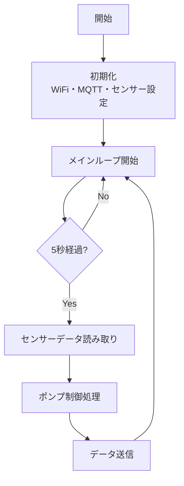
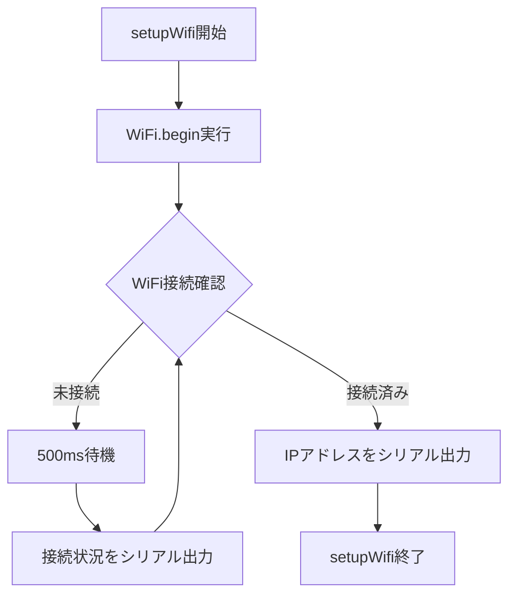
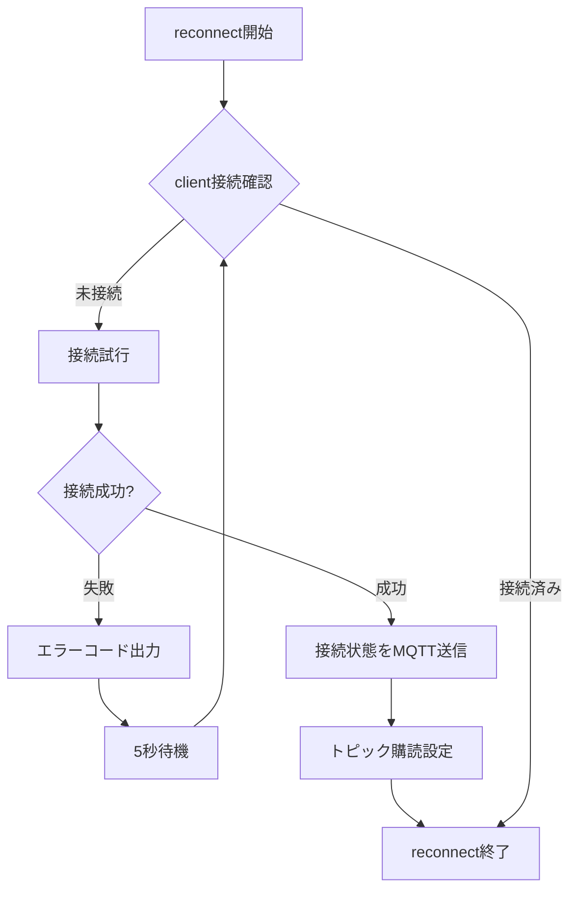
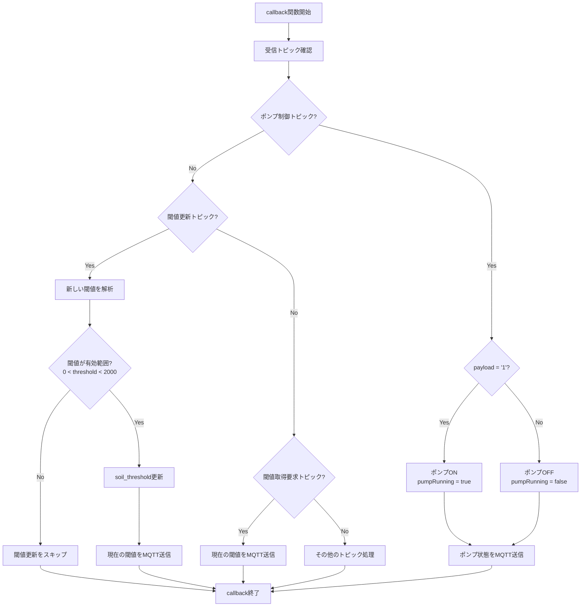
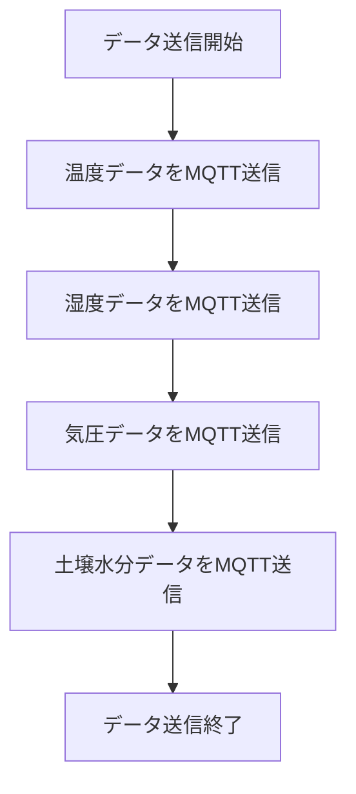

# IoT水やりシステム フローチャート

## システム概要
ESP8266を使用した自動水やりシステムで、BME280センサーで温湿度・気圧を測定し、土壌水分センサーで土の乾燥度を監視して自動給水を行います。

## メインフローチャート



## WiFi接続フロー



## MQTT接続フロー



## MQTTコールバック処理フロー



## ポンプ制御フロー

```mermaid
flowchart TD
    A[ポンプ制御開始] --> B{ポンプ稼働中?}
    B -->|Yes| C{3秒経過?}
    C -->|Yes| D[ポンプ停止<br/>pumpRunning = false]
    C -->|No| E[ポンプ継続]
    D --> F[ポンプ状態をMQTT送信]
    E --> F
    
    B -->|No| G{土壌が乾燥?<br/>soil_value > threshold}
    G -->|Yes| H[ポンプ開始<br/>pumpRunning = true]
    G -->|No| I[ポンプ停止状態維持]
    H --> J[開始時刻記録<br/>pumpStartTime = millis()]
    J --> K[ポンプ状態をMQTT送信]
    I --> L[ポンプ制御終了]
    F --> L
    K --> L
```

## センサーデータ読み取りフロー

```mermaid
flowchart TD
    A[センサーデータ読み取り開始] --> B[BME280: 温度読み取り]
    B --> C[BME280: 湿度読み取り]
    C --> D[BME280: 気圧読み取り]
    D --> E[土壌水分センサー読み取り<br/>soil_value = analogRead(SENSE_PIN)]
    E --> F[データをシリアル出力]
    F --> G[センサーデータ読み取り終了]
```

## データ送信フロー



## 主要変数

| 変数名 | 型 | 説明 |
|--------|----|----|
| `soil_value` | float | 土壌水分センサーの値 |
| `soil_threshold` | int | 土壌水分閾値（デフォルト: 1024） |
| `pumpRunning` | bool | ポンプ稼働状態フラグ |
| `pumpStartTime` | unsigned long | ポンプ開始時刻 |
| `pumpDuration` | const unsigned long | ポンプ稼働時間（3000ms = 3秒） |
| `readInterval` | const unsigned long | センサー読み取り間隔（5000ms = 5秒） |

## 主要機能

1. **自動水やり制御**: 土壌水分が閾値を超えると自動でポンプを3秒間稼働
2. **センサーデータ監視**: 温度、湿度、気圧、土壌水分を5秒間隔で測定
3. **MQTT通信**: センサーデータとポンプ状態をMQTTブローカーに送信
4. **リモート制御**: MQTT経由でポンプの手動制御と閾値設定が可能
5. **WiFi接続**: ESP8266のWiFi機能でネットワークに接続

## 使用センサー・デバイス

- **ESP8266**: WiFi通信とメイン制御
- **BME280**: 温度・湿度・気圧センサー（SPI通信）
- **土壌水分センサー**: アナログ入力（A0ピン）
- **給水ポンプ**: デジタル出力（HUMIピン） 
